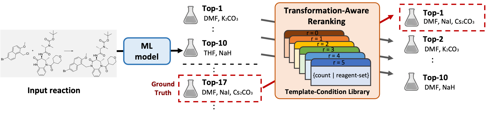

# Transformation-Aware Reranking (TAR)

Code for the paper: **"Bridging the Gap Between AI Predictions and Chemical Conventions: Template-Guided Reranking for Accurate Reagent Set Suggestion"**

Given a reactant→product SMILES pair, the task is to predict the reaction conditions (catalysts, solvents, reagents). We show that post-hoc reranking of ML beam-search outputs using a reaction template prior consistently improves exact-match accuracy across multiple models.

<p align="center">
  
</p>

---

## Method: Transformation-Aware Reranking (TAR)

Each candidate condition set $c_i$ from a model's beam is rescored:

$$\text{score}(c_i) = \log P_\text{ML}(c_i) + \lambda_\text{eff} \cdot \log P(\text{flat-set} \mid \text{template})$$

with entropy-adaptive weighting:

$$\lambda_\text{eff} = \frac{\lambda}{1 + \alpha \cdot H(T)}$$

where $H(T)$ is the Shannon entropy of the template's condition distribution. High-entropy (ambiguous) templates receive less weight; $\alpha = 0$ recovers fixed-$\lambda$ reranking.

Templates are matched at six radii (r0–r5); the finest matching radius is used. The template library is built from training data only.

---

## Repository Structure

```
data_preparation/
  step1_preprocessing/              # Pistachio raw data -> model-ready CSVs (run in this order)
    solvents.py                       # SMILES <-> name lookup for 96 solvents (shared)
    reagents_classification.py        # HeuristicRoleClassifier: SMILES -> cat/solv/reagent role
    data_filtering.py                 # Main pipeline: raw JSON -> filtered reactions
    extract_labels_pistachio2m.py     # Build cat/solv/reag label vocabularies
    prepare_model_data.py             # 8:1:1 split + convert to model input format (GCN_data_*.csv, etc.)
  step2_extract_templates/          # Reaction template extraction (radii r0-r5)
    extract_templates_pistachio2m.py  # Extract template_r0..r5 SMARTS columns
    localtemplate/                    # LocalTemplate extraction library (bundled)
  step3_build_template_library.py   # Build Template Library from data
  step4_compute_entropy.py          # Compute template Shannon entropy

models/
  gao/                        # Gao et al. 2018 (Morgan FP, role-separated autoregressive)
    train.py
    evaluate.py                # Beam search inference
  quarc/                      # QUARC (D-MPNN, roleagnostic + reaction class)
    train.py
    evaluate.py                # Beam search inference
  reacon/                     # Reacon (GCN, role-separated)
    train.sh                  # SLURM batch script
    evaluate.py               # Beam search inference only from ML model (Reacon*)
    evaluate_orig.py          # Condition library–based evaluation (Reacon)
    chemprop/                 # Bundled chemprop v1.6.1 (required; pip version is v2.x)
  popularity/
    popularity_template.py    # Template-based popularity baseline
    popularity_rxnclass.py    # Reaction class–based popularity baseline

tar/
  template_reranker.py        # Core TAR classes (TemplateReranker, RoleAgnosticTemplateReranker)
  rerank_all.py               # Run TAR on all models; λ/α sweep
```

---

## Setup

**Python environment:** Python 3.10, PyTorch 2.7 (CUDA 12.8), RDKit 2025.09, chemprop 1.6.1.
The exact environment used for all experiments is in `environment.yml`:

```bash
conda env create -f environment.yml
conda activate tar
```

Minimal manual install (if you don't want the full pinned environment):

```bash
pip install torch rdkit-pypi chemprop==1.6.1   # for GAO/QUARC
# Note: models/reacon/ uses the bundled chemprop (v1.6.1) — do NOT pip-install for Reacon
```

**Data:** This study uses the Pistachio dataset (NextMove Software), which is licensed and **cannot be redistributed**. We therefore do not provide the processed data. To reproduce it, obtain your own Pistachio 2026Q1 license and run the preprocessing pipeline in `data_preparation/` (see [Data Preparation](#data-preparation) below), which produces:

```
Data/
  data_{train,val,test}.csv
  data_{train,val,test}_template.csv
  labels/{cat,solv,reag}_labels.csv
  MPNN_data/GCN_data_{train,val,test}.csv
```

**Model checkpoints:** Pre-trained checkpoints for all three models are provided. They are too large for GitHub, so download them from the external archive and place them at:

```
models/gao/gao2018/best_model.pt
models/quarc/roleagnostic_gnn_rxnclass/best_model.pt
models/reacon/GCN_{cat,solv0,solv1,reag0,reag1}/fold_0/model_0/model.pt
```

With the checkpoints and your regenerated `Data/` in place you can run inference directly (Step 3 below) without retraining. Retraining (Step 0) is optional and only needed to reproduce the checkpoints from scratch.

---

## Pipeline

**Step 0 — Train models** *(optional; pre-trained checkpoints are provided — skip to Step 1 if you downloaded them)*:

```bash
# QUARC rxnclass
cd models/quarc && python train.py

# GAO 2018
cd models/gao && python train.py

# Reacon (SLURM)
cd models/reacon && sbatch train.sh
```

**Step 1 — Build the template library** (from training + val data):

```bash
python data_preparation/step3_build_template_library.py
```

Output: `Data/{standard,flat}_template_library.pkl`

**Step 2 — Compute template entropy**:

```bash
python data_preparation/step4_compute_entropy.py
```

Output: `Data/entropy_analysis.csv`

**Step 3 — Run model inference** (generates beam CSVs):

```bash
# QUARC rxnclass
cd models/quarc && python evaluate.py

# GAO 2018
cd models/gao && python evaluate.py

# Reacon* (ML beam only; output feeds TAR)
cd models/reacon && python evaluate.py

# Reacon (original: template-library-based, standalone baseline — not fed to TAR)
cd models/reacon && python evaluate_orig.py
```

(All evaluate scripts default to `--split test`; pass `--split val` for the validation set.)

**Step 4 — Apply TAR reranking**:

```bash
cd tar
python rerank_all.py --lam 2.0 --alpha 1.0                  # all models

# single model (short aliases = beam30, test split)
python rerank_all.py --model quarc  --lam 4.0 --alpha 1.0
python rerank_all.py --model gao    --lam 2.0 --alpha 1.0
python rerank_all.py --model reacon --lam 2.0 --alpha 1.0
```

Output: `tar/TAR_Results/` (metric reports) and `tar/InferenceResults/` (reranked CSVs).

**Popularity baselines** (rule-based, no ML model — evaluated directly):

```bash
cd models/popularity
python popularity_template.py     # template-based popularity (Pop-Temp)
python popularity_rxnclass.py     # reaction class–based popularity (Pop-Class)
```

`popularity_template.py` looks up the most frequent condition sets seen with the matched
template (r5→r0); `popularity_rxnclass.py` uses the Pistachio reaction-class hierarchy
instead. Each writes a predictions CSV + metrics report alongside the script.

---

## Data Preparation

The processed `Data/` cannot be redistributed (Pistachio license). To regenerate it from your own Pistachio 2026Q1 license, run the pipeline in `data_preparation/` in order.

**Step 1 — Filtering, labels, and split** (`step1_preprocessing/`):

```bash
cd data_preparation/step1_preprocessing
python data_filtering.py            # raw Pistachio JSON -> P2026_Final.csv (+ Data/data_total.csv)
python extract_labels_pistachio2m.py  # -> Data/labels/{cat,solv,reag}_labels.csv
python prepare_model_data.py        # 8:1:1 random split + Data/MPNN_data/GCN_data_{split}.csv
```

This produces `Data/data_{train,val,test}.csv`, the label vocabularies, and the MPNN input files.

**Step 2 — Template extraction** (`step2_extract_templates/`): re-extract templates from reaction SMILES (produces `template_r0`–`template_r5` SMARTS columns):

```bash
cd data_preparation/step2_extract_templates
python extract_templates_pistachio2m.py \
    --src_path ../../Data/data_val_simple.csv \
    --out_path ../../Data/data_val_template.csv
```

Run once per split to produce `Data/data_{train,val,test}_template.csv`.


